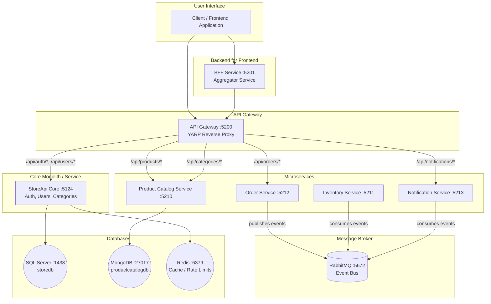

# StoreApi Microservices Architecture

Welcome to the **StoreApi Microservices Architecture** project! This is an enterprise-grade, highly scalable, and event-driven e-commerce platform built using **.NET 8**, **Docker**, and distributed cloud-native patterns.

The architecture is composed of an API Gateway, a Backend-for-Frontend (BFF), distinct microservices with their own dedicated databases (SQL Server and MongoDB), in-memory caching and rate-limiting using Redis, and asynchronous communication powered by MassTransit and RabbitMQ.

---

## 🏗️ Architectural Topology

A visual representation of the system’s design, component boundaries, and communications flow is outlined below. This diagram reflects your current deployment configuration:



---

## 🧭 Service Discovery & Complete URL Registry

All system endpoints, direct ports, and dashboard consoles are exposed as follows when running under Docker:

### 🌍 Edge Services & Gateway Gateways (Client Entry Points)
*   **API Gateway (YARP)**: **[http://localhost:5200](http://localhost:5200)** — *The single entry-point routing to all services. Integrates all services' Swaggers.*
*   **BFF (Backend for Frontend)**: **[http://localhost:5201](http://localhost:5201)** — *Aggregates orders with corresponding Catalog specs.*
    *   Swagger Docs: **[http://localhost:5201/swagger](http://localhost:5201/swagger)**
*   **StoreApi App (Core & Identity)**: **[http://localhost:5124](http://localhost:5124)** — *Handles core monolith/auth operations.*
    *   Swagger Docs: **[http://localhost:5124/swagger](http://localhost:5124/swagger)**

### ⚙️ Microservices (Direct Internal/External Ports)
*   **Product Catalog Service**: **[http://localhost:5210](http://localhost:5210)** (Swagger: [http://localhost:5210/swagger](http://localhost:5210/swagger))
*   **Inventory Service (Async Event-Worker)**: **[http://localhost:5211](http://localhost:5211)** (Swagger: [http://localhost:5211/swagger](http://localhost:5211/swagger))
*   **Order Service**: **[http://localhost:5212](http://localhost:5212)** (Swagger: [http://localhost:5212/swagger](http://localhost:5212/swagger))
*   **Notification Service**: **[http://localhost:5213](http://localhost:5213)**

### 📊 Infrastructure & Datastores
*   **RabbitMQ Management Portal**: **[http://localhost:15672](http://localhost:15672)** (User: `guest` | Pass: `guest`) — *Used to monitor communication logs and queues.*
*   **Microsoft SQL Server**: `localhost,1433` (Database: `storedb` | Password: `Strong@Passw0rd!`)
*   **MongoDB Database**: `mongodb://localhost:27017` (Database: `productcatalogdb`)
*   **Redis Cache Server**: `localhost:6379` (Database Index: `0`)

---

## 🛠️ Technological & Architectural Highlights

1. **Backend For Frontend (BFF) Pattern**:
   Aggregates disparate microservice calls (querying order statuses from `OrderService` and stitching corresponding details with descriptive assets from `ProductCatalogService` automatically) to minimize client-side over-fetching and resource round-trips.

2. **Database-Per-Service Autonomy**:
   Each major service owns its domain datastore strictly. `StoreApi` utilizes **SQL Server**, `ProductCatalogService` uses **MongoDB**, and `OrderService` leverages in-memory state tracking, securing loose-coupling and scalability.

3. **Event-Driven Choreography (Sagas/Events)**:
   Services communicate asynchronously via **MassTransit** over **RabbitMQ**. For example:
   * `OrderService` publishes `OrderPlacedEvent`.
   * `InventoryService` consumes `OrderPlacedEvent` to verify/allocate stock, and can emit `InventoryRejectedEvent` back to trigger a compensation path (`OrderStateStore.Cancel`).

4. **YARP API Gateway Aggregation**:
   The API Gateway proxy consolidates routing and consolidates downstream Swagger specs under a unified dropdown control pane on `http://localhost:5200/swagger`.

5. **Distributed Cache Decoupling (Redis)**:
   Utilizes highly performance-oriented multi-level decorating layers with Redis caching to avoid database stress spikes on slow database scans.

---

## 🚀 How to Run the Project

Running the whole stack on your developer machine is fully automated through Docker Compose.

### Prerequisites:
*   [Docker Desktop](https://www.docker.com/products/docker-desktop/) installed & active.
*   C# SDK 8 (Optional for running outside of Docker containers).

### Commands:

1.  **Launch the System (Containers mode)**:
    ```bash
    docker-compose up --build -d
    ```
2.  **Verify Running Containers**:
    ```bash
    docker compose ps
    ```
3.  **Inspect Live Combined Logs**:
    ```bash
    docker-compose logs -f
    ```
4.  **Shutdown Stack & Clear Volumes**:
    ```bash
    docker-compose down -v
    ```
